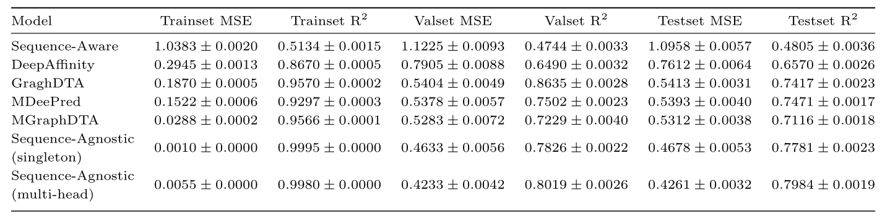
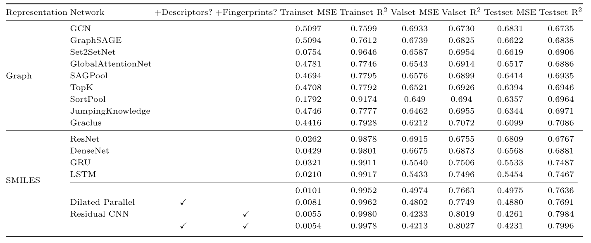
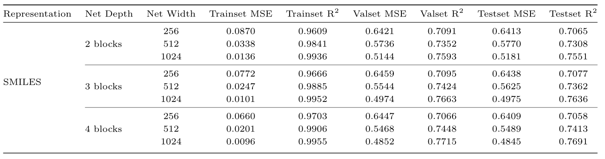
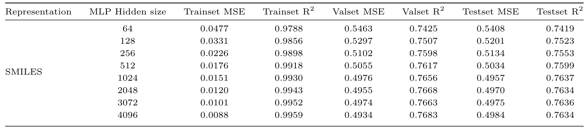
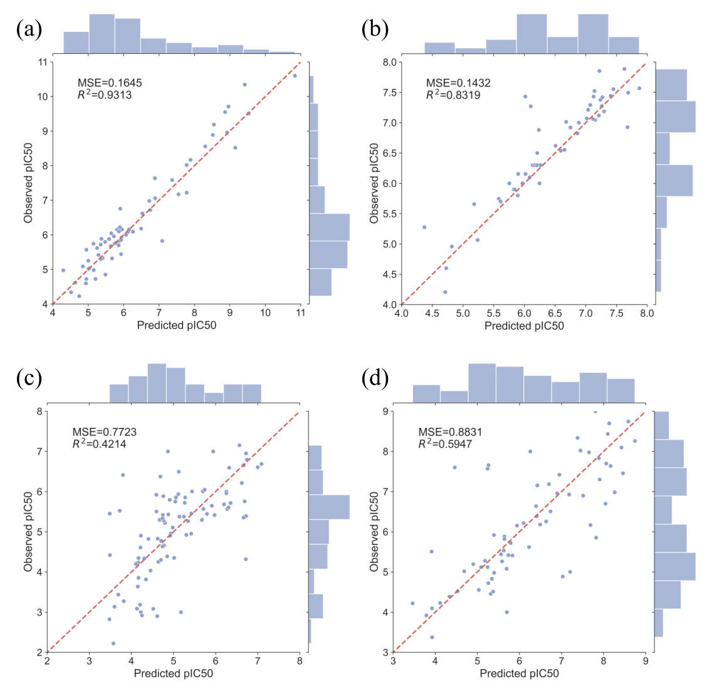

# SAM-DTA: A Sequence-Agnostic Model for Drug-Target Binding Affinity Prediction

Code for paper SAM-DTA: A Sequence-Agnostic Model for Drug-Target Binding Affinity Prediction. 


> [SAM-DTA: A Sequence-Agnostic Model for Drug-Target Binding Affinity Prediction](https://doi.org/10.1093/bib/bbac533) \
> Authors: Zhiqiang Hu, Wenfeng Liu, Chenbin Zhang, Jiawen Huang, Shaoting Zhang, Huiqun Yu, Yi Xiong, Hao Liu, Song Ke, Liang Hong \

Contact: huzhiqiang@sensetime.com. Feel free to ask any questions or discussions!

<div align="center"></div>


## Abstract:

Drug-target binding affinity prediction is a fundamental task for drug discovery and has been studied for decades. Most methods follow the canonical paradigm that processes the inputs of the protein (target) and the ligand (drug) separately and then combines them together. In this study we demonstrate, surprisingly, that a model is able to achieve even superior performance without access to any protein-sequence-related information. Instead, a protein is characterized completely by the ligands that it interacts. Specifically, we treat different proteins as separate tasks, which are jointly trained in a multi-head manner, so as to learn a robust and universal representation of ligands that is generalizable across proteins. Empirical evidences show that the novel paradigm outperforms its competitive sequence-based counterpart, with the MSE of 0.4261 vs 0.7612 and the R-Square of 0.7984 vs 0.6570 compared with DeepAffinity. We also investigate the transfer learning scenario where unseen proteins are encountered after the initial training, and the cross-dataset evaluation for prospective studies. The results reveals the robustness of the proposed model in generalizing to unseen proteins, as well as in predicting future data. Codes will be released to facilitate the research.


## Experiments


### Benchmark
- Performance comparison of the proposed sequence-agnostic model (SAM-DTA) against six representative methods from different aspects.
<div align="center"></div>

### Ablation study 
- Performance comparison of different ligand representations and their combinations.
<div align="center"></div>

- Performance comparison of different net depth and width for the CNN architecture under the SMILES ligand representation.
<div align="center"></div>

- Performance comparison of different hidden sizes for the MLP module. 
<div align="center"></div>

### Visualization results for the proposed modules 

- Scatter plots of best-performing ((a) THRB, UniProt ID: P10828, #139/401 and (b) BRD3, UniProt ID: Q15059, #369/401) and worst-performance ((c) IDO1, UniProt ID: P14902, #229/401 and (d) Adora1, UniProt ID: P25099, #278/401) proteins by SAM-DTA.
<div align="center"></div>


## Usage: 


### Main requirements
  * **Python 3.7**
  * **torch = 1.10.0**
  * **torchvision = 0.11.0**
  * **numpy = 1.21.5**
  * **scikit-learn = 1.0.2**

### Preparing Data
Please organize each dataset as the following structure:

```
dataset
└── raw_dataset
    ├── protein_0000
    |   └── train.csv
        └── val.csv
        └── test.csv
    ├── protein_0001
    └── ...
├── seqs.txt
├── Descriptor.pt
└── smis.csv
    
...
```

### Training

Run "launch.py" for generating config files (end with *.yaml* or *test.yaml*)

Run "multi_task_main.py" for training (using the *.yaml* configuration files in `./configs/`).


### Testing

Similar with training, run "test.py" (using the *test.yaml* configuration files in `./configs/`).


